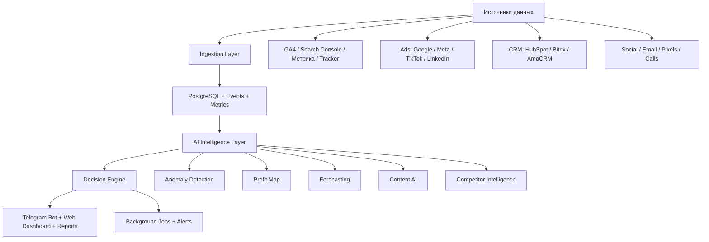

# TrafficMindAI Enterprise Blueprint

TrafficMindAI должен развиваться не как "бот с отчетами", а как AI growth operating system для малого и среднего бизнеса: владелец подключает источники данных, а система сама объясняет, где появляются деньги, где они теряются и какие действия дадут максимальный эффект.

## Позиционирование

TrafficMindAI находится между HubSpot, SimilarWeb, Google Analytics, SEMrush, Hotjar и AI-маркетологом. Главная ценность: не собирать цифры в панели, а превращать данные в решения.

Пользовательский ответ системы всегда должен закрывать восемь вопросов:

1. Что происходит?
2. Почему это происходит?
3. Насколько это критично?
4. Что делать первым?
5. Какой эффект даст действие?
6. Что прогнозируется дальше?
7. Где теряются деньги?
8. Какие возможности роста есть сейчас?

## Новая продуктовая структура

- Dashboard - executive summary бизнеса за сегодня.
- Карта прибыли - деньги, лиды, продажи, ROI и пути пользователя.
- Аудит - сайт, SEO, скорость, формы, пиксели, аналитика, CRM и UTM.
- Потери - страницы, каналы и этапы воронки, где теряются лиды и доход.
- AI-маркетолог - вопросы, объяснения, гипотезы, корреляции и рекомендации.
- Что делать сегодня - приоритизированные задачи с эффектом, сложностью и прогнозом.
- Content AI - посты, Reels, объявления, email, CTA и SEO-контент на основе данных.
- Конкуренты - трафик, страницы, ключевые слова, объявления и социальная активность.
- Прогнозы - лиды, доход, CPL, ROAS и сценарии бюджета.
- Отчеты - ежедневные, недельные, месячные, PDF и Telegram summaries.
- Интеграции - аналитика, реклама, CRM, соцсети, email и пиксели.
- Подписка - тарифы, лимиты, счета, trial и доступы.
- Админ-панель владельца - пользователи, сайты, подписки, события, ошибки, выручка.

## Архитектура продукта

## Системный дизайн

### Data Ingestion

Каждая интеграция должна приводить данные к нормализованным сущностям:

- `MarketingEvent` - событие пользователя, клика, формы, звонка или покупки.
- `ChannelMetric` - агрегат канала за период.
- `FunnelStep` - этап воронки и потери между этапами.
- `RevenueAttribution` - деньги, лиды и продажи по источнику.
- `IntegrationAccount` - подключение внешнего сервиса.

### Intelligence Layer

Слой принимает нормализованные данные и создает:

- `Insight` - что произошло и почему.
- `ActionItem` - что делать сегодня.
- `Forecast` - что будет дальше.
- `Risk` - где теряются деньги.
- `Opportunity` - где можно расти.
- `ContentBrief` - что публиковать и запускать в рекламу.

### AI-маркетолог

AI не должен просто отвечать в стиле чата. Он должен работать как аналитический агент:

1. Получить бизнес-контекст.
2. Собрать свежие метрики.
3. Найти аномалии и корреляции.
4. Оценить критичность.
5. Сформировать гипотезы.
6. Присвоить приоритет задачам.
7. Спрогнозировать эффект.
8. Объяснить простым языком.

## Интеграции

### Аналитика

- Google Analytics 4 - трафик, события, источники, аудитории.
- Google Search Console - запросы, показы, клики, CTR, позиции.
- Яндекс Метрика - визиты, цели, вебвизор-события, источники.
- UTM analytics - кампании, объявления, креативы, медиумы.
- Heatmaps - клики, скролл, зоны внимания.
- Call Tracking - звонки и качество обращений.

### Реклама

- Google Ads - кампании, расходы, клики, конверсии.
- Meta Ads - Instagram/Facebook кампании, креативы, CPL.
- TikTok Ads - видео, клики, лиды, удержание.
- LinkedIn Ads - B2B лиды, кампании и CPL.

### CRM

- HubSpot - сделки, лиды, стадии, revenue attribution.
- Bitrix - лиды, сделки, источники, менеджеры.
- AmoCRM - воронки, сделки, причины потерь.

### SMM и Content

- Instagram, TikTok, Facebook, LinkedIn, YouTube.
- Mailchimp, Brevo, Klaviyo.
- Meta Pixel, TikTok Pixel, Google Tag Manager.

## Карта прибыли

Переименование: "Карта трафика" становится "Карта прибыли".

Размер узла:

- прибыль;
- лиды;
- продажи;
- доход;
- потенциальный доход.

Цвет узла:

- ROI;
- конверсия;
- эффективность;
- качество лида.

Связи:

- путь пользователя;
- касания;
- этапы воронки;
- multi-touch attribution;
- переходы между каналами.

Визуализации:

- radial profit map;
- Sankey journey;
- funnel loss map;
- cohort comparison;
- budget scenario simulation.

Главный вопрос экрана: "Откуда приходят деньги?"

## Что делать сегодня

Задача должна хранить:

- название;
- причину;
- ожидаемый эффект;
- влияние на доход;
- сложность;
- время выполнения;
- прогноз роста;
- приоритет;
- доказательство из данных.

Пример:

| Задача | Эффект | Сложность | Приоритет |
|---|---:|---:|---:|
| Исправить форму на странице `/menu` | +12-18 лидов/мес | низкая | высокий |
| Добавить Meta Pixel | точнее ретаргетинг | средняя | высокий |
| Перенести бюджет в TikTok | +18-25 лидов | средняя | средний |

## Production архитектура

- FastAPI API.
- aiogram 3 Telegram Bot.
- PostgreSQL как transactional store.
- Redis для очередей, кеша и rate limiting.
- Celery для ingestion, отчетов, alerts и прогнозов.
- Object Storage для PDF/PNG/exports.
- Playwright для PNG-рендера карты.
- SQLAlchemy + Alembic migrations.
- Pydantic schemas для контрактов.
- OpenAI API или совместимая LLM gateway для AI reasoning.
- Feature flags для enterprise-функций.
- Observability: structured logs, Sentry, Prometheus/Grafana.
- RBAC: owner, admin, analyst, client, agency.
- Tenant isolation: все данные привязаны к organization_id.

## SaaS $100M+ идеи

- AI Growth Copilot, который сам создает weekly growth plan и отслеживает выполнение.
- Revenue Attribution Graph по всем касаниям клиента.
- Benchmark Index: сравнение бизнеса с похожими компаниями по нише и региону.
- Auto Budget Reallocator: рекомендация перераспределения бюджета между каналами.
- AI Creative Lab: генерация объявлений на основе источников, которые реально дают лиды.
- Competitor Moves Radar: уведомления о новых страницах, объявлениях и контенте конкурентов.
- Agency Mode: white label отчеты для клиентов агентств.
- Marketplace интеграций и шаблонов роста по нишам.
- Confidence Score для каждой рекомендации: насколько данные подтверждают вывод.
- "Money Leak Insurance": мониторинг критичных потерь и мгновенные Telegram alerts.
